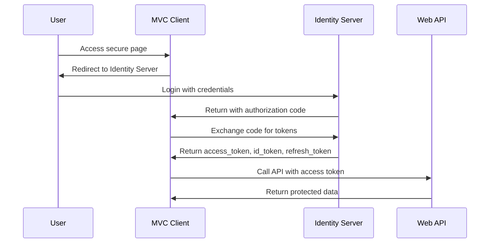

# Identity Server 4 Complete Project

A complete Identity Server 4 implementation with MVC Client and protected Web API. This project demonstrates authentication, authorization, and API protection using OpenID Connect and OAuth 2.0.

## 🏗️ Project Architecture

```
IdentityServer4-Complete-Project/
├── IdentityServer/          # Central Authentication Server (Port 5001)
├── MvcClient/              # MVC Web Application Client (Port 5002)
├── ApiProject/             # Protected Web API (Port 5004)
└── README.md
```

## 📋 Prerequisites

- [.NET 6.0 SDK](https://dotnet.microsoft.com/download/dotnet/6.0)
- [Visual Studio 2022](https://visualstudio.microsoft.com/) or [VS Code](https://code.visualstudio.com/)
- Postman (for API testing)

## 🚀 Quick Start

### 1. Clone and Setup

```bash
# Clone the repository
git clone <repository-url>
cd IdentityServer4-Complete-Project

# Restore packages for all projects
dotnet restore
```

### 2. Run All Projects

Open three separate terminal windows and run:

**Terminal 1 - Identity Server:**
```bash
cd IdentityServer
dotnet run
```
✅ Server running on: `https://localhost:5001`

**Terminal 2 - Web API:**
```bash
cd ApiProject
dotnet run
```
✅ API running on: `https://localhost:5004`

**Terminal 3 - MVC Client:**
```bash
cd MvcClient
dotnet run
```
✅ Client running on: `https://localhost:5002`

### 3. Test the Application

1. Open browser to: `https://localhost:5002`
2. Click "Login" 
3. Use test credentials:
   - **Admin User**: `alice` / `password`
   - **Regular User**: `bob` / `password`
4. Explore protected pages and API calls

## 🔐 Test Users

| Username | Password | Role | Access Level |
|----------|----------|------|-------------|
| alice | password | admin | Full access to all pages and admin APIs |
| bob | password | user | Access to regular pages and basic APIs |

## 🌐 Endpoints Overview

### Identity Server (5001)
- **Login Page**: `https://localhost:5001/Account/Login`
- **Discovery**: `https://localhost:5001/.well-known/openid-configuration`
- **Token**: `https://localhost:5001/connect/token`
- **UserInfo**: `https://localhost:5001/connect/userinfo`

### MVC Client (5002)
- **Home**: `https://localhost:5002`
- **Secure Page**: `https://localhost:5002/Home/Secure`
- **Admin Page**: `https://localhost:5002/Home/Admin`
- **API Test**: `https://localhost:5002/Home/CallApi`
- **User Info**: `https://localhost:5002/Home/UserInfo`
- **Tokens**: `https://localhost:5002/Home/Tokens`

### Web API (5004)
- **Public Weather**: `GET https://localhost:5004/weather/public`
- **Protected Weather**: `GET https://localhost:5004/weather` (requires auth)
- **Admin Weather**: `GET https://localhost:5004/weather/admin` (requires admin role)

## 🔧 Project Configuration

### IdentityServer Configuration

**Program.cs** - Main setup:
```csharp
builder.Services.AddIdentityServer()
    .AddDeveloperSigningCredential()
    .AddInMemoryApiResources(Config.GetApiResources())
    .AddInMemoryApiScopes(Config.GetApiScopes())
    .AddInMemoryClients(Config.GetClients())
    .AddInMemoryIdentityResources(Config.GetIdentityResources())
    .AddTestUsers(Config.GetTestUsers());
```

**Clients Configuration:**
- `mvc_client`: MVC application using Authorization Code flow
- `api_client`: Machine-to-machine communication using Client Credentials
- `postman_test`: For Postman testing with Password grant

### MVC Client Configuration

**Authentication Setup:**
```csharp
services.AddAuthentication(options =>
{
    options.DefaultScheme = CookieAuthenticationDefaults.AuthenticationScheme;
    options.DefaultChallengeScheme = OpenIdConnectDefaults.AuthenticationScheme;
})
.AddCookie()
.AddOpenIdConnect("oidc", options =>
{
    options.Authority = "https://localhost:5001";
    options.ClientId = "mvc_client";
    options.ClientSecret = "mvc_secret";
    options.ResponseType = "code";
    options.SaveTokens = true;
});
```

### Web API Configuration

**JWT Bearer Authentication:**
```csharp
services.AddAuthentication(JwtBearerDefaults.AuthenticationScheme)
    .AddJwtBearer(options =>
    {
        options.Authority = "https://localhost:5001";
        options.Audience = "weather_api";
    });
```

## 🧪 Testing with Postman

### 1. Get Access Token (Password Grant)

**Request:**
```http
POST https://localhost:5001/connect/token
Content-Type: application/x-www-form-urlencoded

grant_type=password
&username=alice
&password=password
&client_id=postman_test
&client_secret=postman_secret
&scope=weather_api.read roles
```

**Response:**
```json
{
    "access_token": "eyJhbGciOiJSUzI1NiIs...",
    "expires_in": 3600,
    "token_type": "Bearer",
    "scope": "weather_api.read roles"
}
```

### 2. Call Protected API

**Request:**
```http
GET https://localhost:5004/weather
Authorization: Bearer YOUR_ACCESS_TOKEN
Content-Type: application/json
```

### 3. Test Different Scenarios

| Endpoint | Required Role | Alice (admin) | Bob (user) |
|----------|---------------|---------------|------------|
| `/weather` | User | ✅ 200 OK | ✅ 200 OK |
| `/weather/admin` | Admin | ✅ 200 OK | ❌ 403 Forbidden |
| `/weather/public` | None | ✅ 200 OK | ✅ 200 OK |

## 📊 Flow Diagrams

### Authentication Flow


### Token Types
- **Access Token**: For API authorization (short-lived)
- **ID Token**: For user authentication information
- **Refresh Token**: For obtaining new access tokens

## 🛠️ Development Features

### MVC Client Features
- ✅ User authentication and logout
- ✅ Role-based authorization (Admin vs User)
- ✅ Token management and display
- ✅ API call testing interface
- ✅ User claims inspection
- ✅ Token refresh functionality

### Web API Features
- ✅ JWT token validation
- ✅ Role-based endpoint protection
- ✅ Public and protected endpoints
- ✅ Policy-based authorization

### Identity Server Features
- ✅ OpenID Connect implementation
- ✅ OAuth 2.0 flows (Code, Client Credentials, Password)
- ✅ Custom login UI
- ✅ In-memory test users and configuration
- ✅ Token generation and validation

## 🔒 Security Configuration

### Clients Setup
```csharp
new Client
{
    ClientId = "mvc_client",
    AllowedGrantTypes = GrantTypes.Code,
    RequirePkce = true,
    RedirectUris = { "https://localhost:5002/signin-oidc" },
    AllowedScopes = { "openid", "profile", "email", "roles", "weather_api.read" }
}
```

### API Scopes
```csharp
new ApiScope("weather_api.read", "Read weather data"),
new ApiScope("weather_api.write", "Write weather data")
```

### Identity Resources
```csharp
new IdentityResources.OpenId(),
new IdentityResources.Profile(),
new IdentityResources.Email(),
new IdentityResource("roles", "User roles", new List<string> { "role" })
```

## 🐛 Troubleshooting

### Common Issues

1. **SSL Certificate Errors**
   - Turn off SSL verification in Postman
   - Or use `http://localhost:5001` (if configured)

2. **CORS Errors**
   - Ensure all services are running
   - Check port configurations

3. **Token Validation Issues**
   - Verify audience and issuer settings
   - Check token expiration

4. **User Login Problems**
   - Use exact test credentials: alice/password or bob/password
   - Check Identity Server logs for authentication errors

### Logs and Debugging

Check each application's console output for detailed logs:

- **Identity Server**: Authentication and token issuance logs
- **MVC Client**: Authentication and API call logs  
- **Web API**: Token validation and authorization logs

## 📁 Project Structure Details

### IdentityServer Project
```
IdentityServer/
├── Controllers/
│   ├── AccountController.cs     # Login/logout handling
│   └── HomeController.cs        # Home page
├── Views/                       # Login and home views
├── Config.cs                    # Clients, resources, users
└── Program.cs                   # Service configuration
```

### MVC Client Project
```
MvcClient/
├── Controllers/
│   └── HomeController.cs        # All application pages
├── Views/Home/
│   ├── Index.cshtml            # Home page
│   ├── Secure.cshtml           # Protected page
│   ├── Admin.cshtml            # Admin-only page
│   ├── CallApi.cshtml          # API testing interface
│   ├── UserInfo.cshtml         # Claims display
│   └── Tokens.cshtml           # Token information
└── Program.cs                  # Authentication setup
```

### Web API Project
```
ApiProject/
├── Controllers/
│   └── WeatherController.cs    # Weather API endpoints
└── Program.cs                  # JWT configuration
```

## 🚀 Deployment Notes

For production deployment:

1. **Replace development certificate** with proper signing credential
2. **Use persistent storage** instead of in-memory configuration
3. **Configure proper client secrets** and redirect URIs
4. **Set up HTTPS** in production environment
5. **Configure logging** and monitoring

## 📚 Learning Resources

- [Identity Server 4 Documentation](https://identityserver4.readthedocs.io/)
- [OpenID Connect Specification](https://openid.net/connect/)
- [OAuth 2.0 Framework](https://oauth.net/2/)
- [ASP.NET Core Security](https://docs.microsoft.com/aspnet/core/security/)

## 🤝 Contributing

Feel free to submit issues and enhancement requests!

## 📄 License

This project is for educational purposes and demonstration of Identity Server 4 capabilities.

---

**Happy Coding!** 🎉